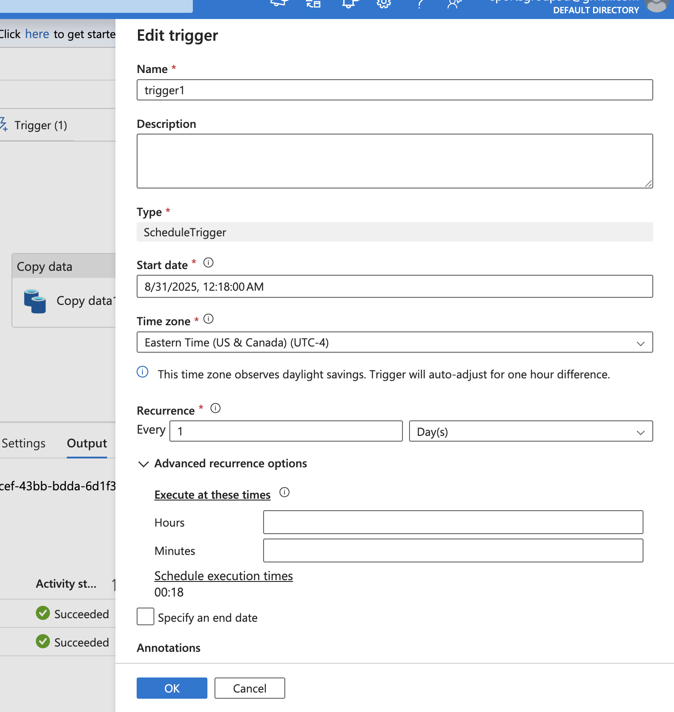
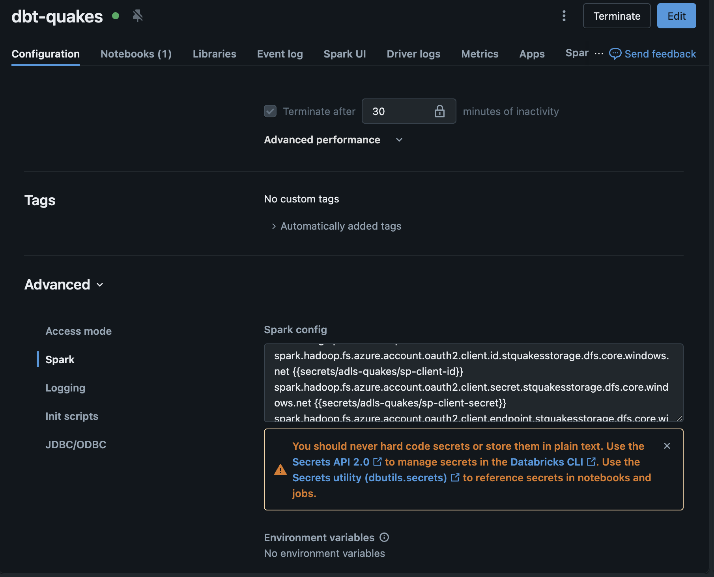
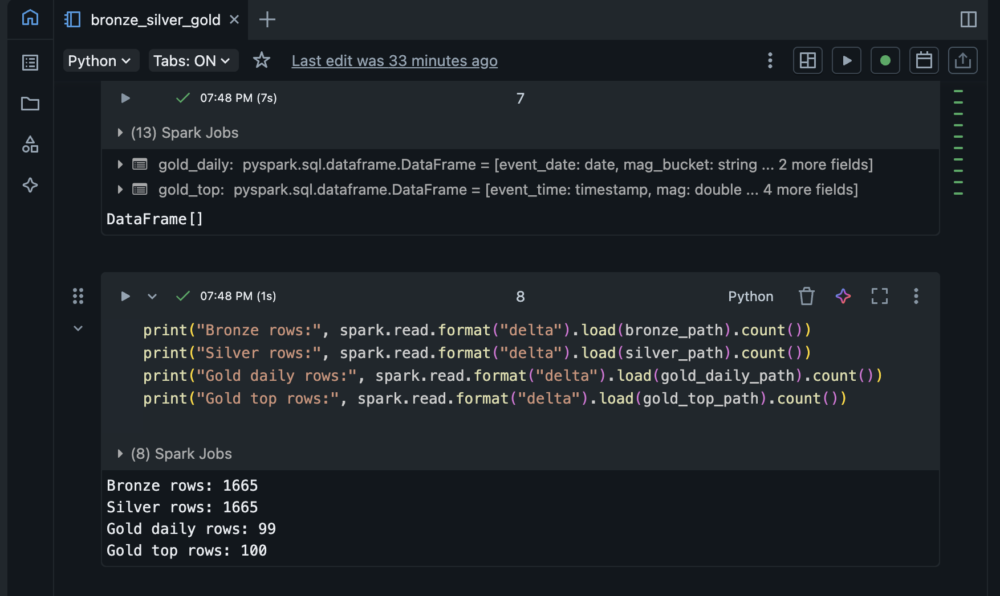
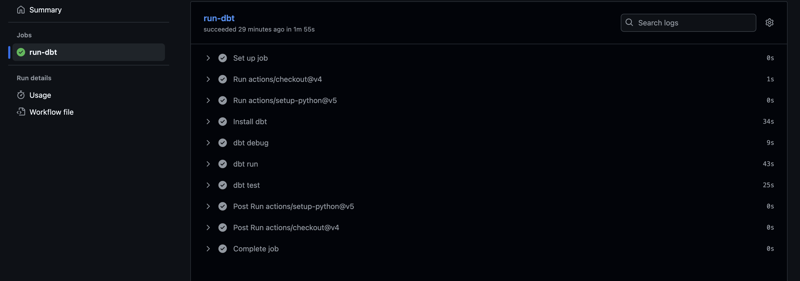
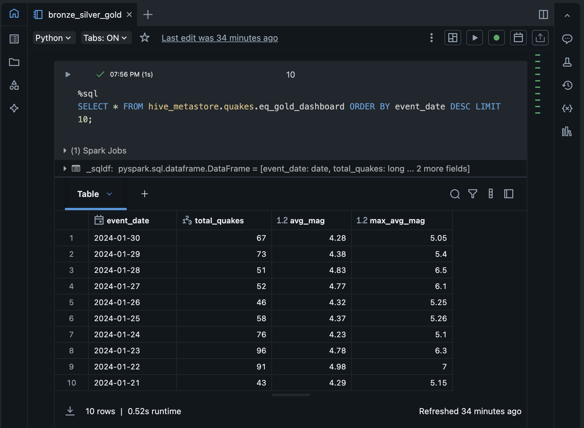
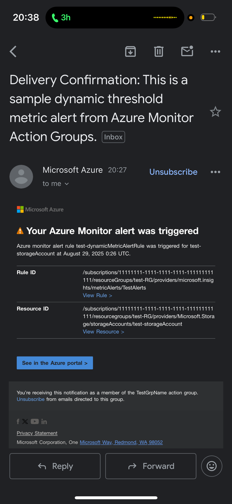

# Azure Earthquakes Lakehouse (ADF → ADLS Gen2 → Databricks → dbt)

This project ingests **USGS Earthquakes** data with **Azure Data Factory** into **ADLS Gen2 (Bronze)**, transforms to **Delta Silver/Gold** with **Azure Databricks**, and models/tests **Gold** with **dbt**. Access is secured via **Azure AD Service Principal** and **Databricks Secrets**. CI/CD runs in **GitHub Actions**.

---

## Screenshots (click to view full size)

> Tip to reviewers: these screenshots show the end-to-end pipeline, data landing, secure config, transformations, gold tables, CI, and alerting.

### 1) ADF Pipeline & Monitor
- **Pipeline canvas** (Copy → Notebook):
  
- **Daily trigger schedule**:
  

### 2) ADLS Gen2 Landing (Bronze)
- **Raw CSV in container**:
  

### 3) Databricks Cluster & Secure Access
- **Spark config with secret refs** (no secrets in plain text):
  

### 4) Notebook Transform Results
- **Notebook completed (row counts)**:
  

### 5) dbt Models & CI
- **GitHub Actions CI (green)**:
  

### 6) Gold Tables (for reporting/screens)
- **Gold dashboard table preview**:
  

### 7) Alerting
- **Azure Monitor notification** (email alert):
  

---

## How this maps to the JD
- **Azure Data Factory**: Orchestration + schedule + alerts  
- **ADLS Gen2**: Bronze landing with RBAC  
- **Azure Databricks (Delta)**: Silver/Gold, secure OAuth via Service Principal & Secrets  
- **dbt**: Gold models & tests, automated via GitHub Actions  
- **Monitoring**: Azure Monitor alert for pipeline failures

## Sample Query

```sql
-- dashboard-friendly rollup
SELECT * 
FROM hive_metastore.quakes.eq_gold_dashboard
ORDER BY event_date DESC
LIMIT 10;
```